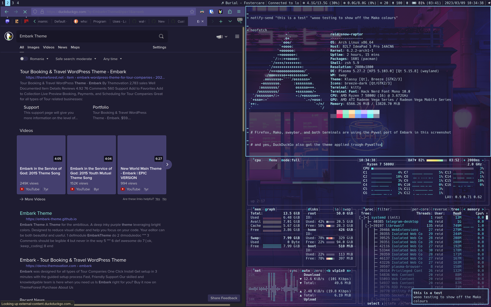

# Embark Pywal
A [Pywal](https://github.com/dylanaraps/pywal/) theme for the ambitious



## Installation
Simply copy `embark.json` to `~/.config/wal/colorschemes/dark/` then set the theme using Pywal

```bash
$ # after cloning and cd'ing inside the repo, run
$ cp embark.json ~/.config/wal/colorschemes/dark/
$ wal --theme embark
```

